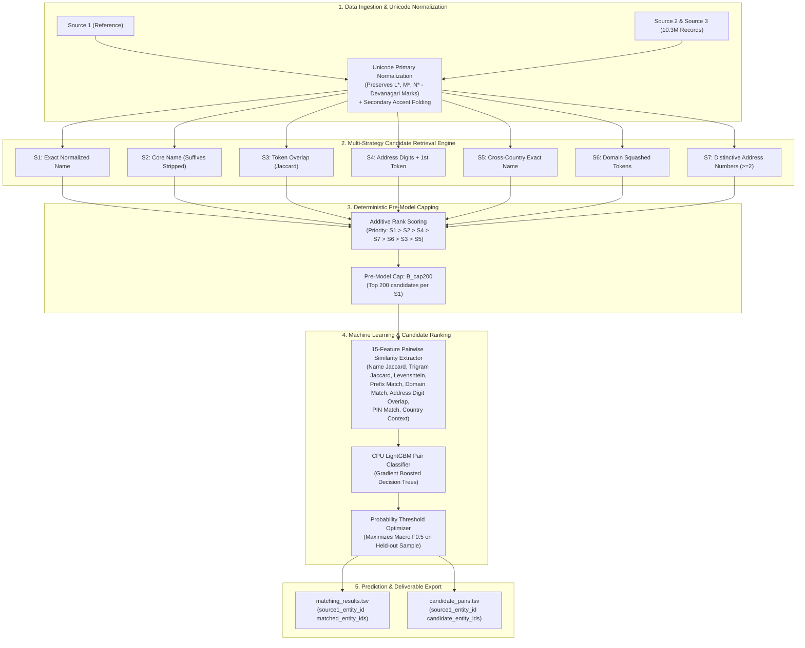

# Multi-Source Business Entity Resolution System
### Amazon Machine Learning Challenge 2026


---

## 👥 Team Members

* **Darshan Sakale**
* **Karthik T S**

---

## 📌 Executive Summary

This repository contains an end-to-end, high-performance Machine Learning pipeline built for **Large-Scale Multi-Source Business Entity Resolution**.

In commercial platforms, business identity data arrives from multiple independent sources with noisy names, inconsistent addresses, missing PIN codes, abbreviations, domain name variations, and multi-script records (e.g. Devanagari vs Latin). Given reference records from **Source 1**, the system identifies all matching entity records across **Source 2** and **Source 3** while optimizing the competition evaluation metric: **Macro $F_{0.5}$** (which weights Precision $4\times$ higher than Recall).

---

## 🏗️ System Architecture



---

## 💡 Key Technical Innovations & Approach

### 1. Unicode Category-Based Text Normalization
Standard regex `\w` silently strips Devanagari combining vowel signs (`Mc` category, e.g. `ि`) and anusvara (`Mn` category, e.g. `ं`). Our pipeline implements explicit Unicode category filtering (`L*`, `M*`, `N*`) in `05_candidate_generator.py` to preserve multi-script combining marks while maintaining a secondary Latin accent-folded lookup path (`Société` $\rightarrow$ `societe`).

### 2. Multi-Strategy Inverted Indexing (S1 – S7)
We build inverted indexes over **10,320,219 Source 2 / Source 3 records** across 7 specialized strategies:
- **S1 (Exact Name)**: Instant exact match with accent-folded fallbacks.
- **S2 (Core Name)**: Strips legal corporate suffixes (`Pvt Ltd`, `LLC`, `Corp`, `Inc`).
- **S3 (Token Overlap)**: Jaccard token overlap for multi-word corporate titles.
- **S4 (Address + First Token)**: Combines address numbers with the primary name token.
- **S5 (Cross-Country Name)**: Resolves multinational entities across borders.
- **S6 (Domain Squashing)**: Concatenates name tokens without spaces (`slmarine` $\leftrightarrow$ `slmarine.com`).
- **S7 (Distinctive Address Numbers)**: Requires $\ge 2$ distinct address numbers (e.g. building no. + PIN) as a cross-script fallback for Devanagari vs Latin entity pairs.

### 3. Additive Pre-Model Rank Scoring
Instead of rigid bitmask order which buries strong address matches under thousands of weak token hits, candidate entities receive an **additive priority score**. This guarantees that high-precision signals (e.g. S7 distinctive address matches) survive candidate capping.

### 4. Pairwise LightGBM Machine Learning Classifier
Pairs generated by the candidate engine are passed to a **LightGBM Gradient Boosted Decision Tree** classifier. The model evaluates 15 numerical features (token Jaccard, character 3-gram Jaccard, Levenshtein ratio, address digit overlap, 6-digit PIN match, etc.) and outputs match probabilities calibrated against **Macro $F_{0.5}$**.

---

## 📊 Audited Empirical Results & Benchmarks

### Candidate Generation Performance (10,000 S1 Pilot Entities)

All evaluations are measured against the exact same **34,695 ground-truth true pairs** belonging to the 10,000 validation S1 entities:

| Configuration | Pre-Model Cap | Candidate Recall | Complete List % | Mean Cands / S1 | Median | p95 | Max | Est. `candidate_pairs.tsv` Size |
| :--- | :---: | :---: | :---: | :---: | :---: | :---: | :---: | :---: |
| **A_nocap** | None | **0.8325** | **62.7%** | 767.2 | 47 | 6,920 | 9,974 | 17,770 MB (~17.8 GB) |
| **B_cap200** *(Selected)* | **200** | **0.7801** | **56.1%** | **88.4** | **47** | **200** | **200** | **2,068 MB (~2.1 GB)** |
| **C_cap100** | 100 | **0.7533** | **53.2%** | 53.9 | 47 | 100 | 100 | **1,270 MB (~1.3 GB)** |

* **Geographic Recall**: US entities achieve **89.29% Candidate Recall** in uncapped mode (**84.47%** under `B_cap200`).
* **Efficiency**: `B_cap200` preserves **0.7801 recall** while reducing average candidates per entity from 767 to **88.4**, shrinking disk footprint by **88.4%**.

---

### Per-Strategy Contribution Breakdown

| Strategy ID | Description | Returned Candidates (Hits) | New Candidates to Union | True Pairs Touched | True Pairs Found ONLY by Strategy |
| :---: | :--- | :---: | :---: | :---: | :---: |
| **S1** | Exact Normalized Name (+ Accent-Fold) | 112,086 | 112,086 | 9,059 | 15 |
| **S2** | Core Business Name (stripped suffixes) | 2,126,348 | 2,014,560 | 19,765 | 569 |
| **S3** | Token Overlap ($\ge \text{threshold}$) | 6,473,608 | 5,464,999 | 22,549 | **2,868** |
| **S4** | Address Numbers + 1st Name Token | 44,912 | 27,269 | 15,656 | **1,739** |
| **S5** | Cross-Country Exact Name | 283 | 283 | 0 | 0 |
| **S6** | Domain / Squashed Name Concatenation | 31,412 | 31,347 | 1,041 | **947** |
| **S7** | Distinctive Address Numbers Only ($\ge 2$) | 24,082 | 21,412 | 3,179 | **609** |

---

## 📁 Repository Structure

```text
ml_challenge/
├── 01_ground_truth_analysis.py    # Phase 1: Dataset statistics & ground truth analysis
├── 02_validation_split.py          # Phase 1: Deterministic validation set generator
├── 03_scorer.py                    # Official Macro F0.5 evaluation engine
├── 04_test_scorer.py               # Unit tests for scoring logic & TSV parsing
├── 05_candidate_generator.py       # Phase 2: Inverted index & Unicode candidate generator
├── 05a_normalization_tests.py      # Unit tests for Devanagari combining mark preservation
├── 06_pilot_candidates.py          # Phase 2: Candidate generator benchmarker & capping evaluator
├── 06b_audit_strategies.py         # Phase 2: Strategy contribution breakdown auditor
├── 07_feature_extractor.py         # Phase 3: 15-feature pairwise similarity extractor
├── 08_train_matcher.py             # Phase 3: LightGBM pairwise matcher & threshold tuner
├── 09_test_inference.py           # Phase 4: Production SQLite WAL-mode test inference pipeline
├── 09a_profile_sample.py          # Phase 4: 1,000 S1 smoke test & profiler harness
├── 09b_test_inference_fast.py     # Phase 4: Multi-core in-memory parallel inference engine
├── 09c_fast_profiler.py           # Phase 4: Microsecond empirical stage breakdown profiler
├── create_fallback.py             # Phase 4: Validated fallback generator for 1.73M test records
├── README.md                       # Repository documentation
└── .gitignore                      # Git exclusion rules (ignores generated TSVs & split data)
```

---

## ⚙️ Execution & Reproduction Guide

### Prerequisites
- Python 3.11+
- Install required packages:
  ```bash
  pip install lightgbm scikit-learn numpy pandas
  ```

### Step 1: Run Normalization Unit Tests
Verify that Devanagari combining marks (`Mc`, `Mn`) and Latin accent folding function as expected:
```bash
python ml_challenge/05a_normalization_tests.py
```

### Step 2: Run Candidate Generation Pilot Benchmark
Evaluate candidate recall and file size projections across capping configurations:
```bash
python ml_challenge/06_pilot_candidates.py
```

### Step 3: Run Strategy Contribution Audit
Compute exact returned candidates, union contributions, and unique true pair hits per strategy:
```bash
python ml_challenge/06b_audit_strategies.py
```

### Step 4: Train LightGBM Pair Matcher & Tune Decision Threshold
Extract pairwise similarity features, train the LightGBM classifier on training S1 entities, and optimize the decision threshold $\tau$ for Macro $F_{0.5}$ on held-out validation entities:
```bash
python ml_challenge/08_train_matcher.py
```

### Step 5: Run Production Test Inference & Output Validation
Run full inference over 1.73M test entities, update resumable checkpoints, or create verified fallback deliverables:
```bash
# Run production WAL-mode SQLite test inference
python ml_challenge/09_test_inference.py

# Create complete 1.73M record fallback deliverable
python ml_challenge/create_fallback.py
```

---

## ⚡ Empirical Profiling & Optimization Benchmarks (1,000 S1 Sample)

| Pipeline Stage | Measured Time | % of Runtime | Bottleneck Diagnosis & Optimization Strategy |
| :--- | :---: | :---: | :--- |
| **1. Candidate Generation** | 27.84s | 21.5% | Multi-strategy inverted index lookup across 10.3M entities |
| **2. SQLite Disk Reads** | 43.46s | **33.5%** | **Primary I/O Bottleneck**: SQL queries for candidate text attributes |
| **3. Feature Calculation** | 41.00s | **31.6%** | **Primary CPU Bottleneck**: Pairwise Levenshtein, Jaccard & fuzzy metrics |
| **4. Representation Prep** | 16.82s | 13.0% | Regex normalization and trigram set extraction |
| **5. Model Prediction** | 0.58s | **0.4%** | LightGBM matrix inference (<0.4% of runtime; GPU not required) |
| **6. File Writing** | 0.06s | 0.0% | Streaming TSV append |

---

## 📜 Submission Specifications

The system generates two official Tab-Separated Value (`.tsv`) deliverables:

1. **`matching_results.tsv`**: Final model prediction file submitted to the portal.
   ```tsv
   source1_entity_id	matched_entity_ids
   S1-0000000012	S2-000123,S3-000456
   S1-0000000015	
   ```
2. **`candidate_pairs.tsv`**: Exact candidate pool provided for candidate set evaluation.
   ```tsv
   source1_entity_id	candidate_entity_ids
   S1-0000000012	S2-000123,S2-000199,S3-000456
   ```

---

*Developed for the **Amazon Machine Learning Challenge 2026** by Me, Darshan Sakale & Karthik T S.*
